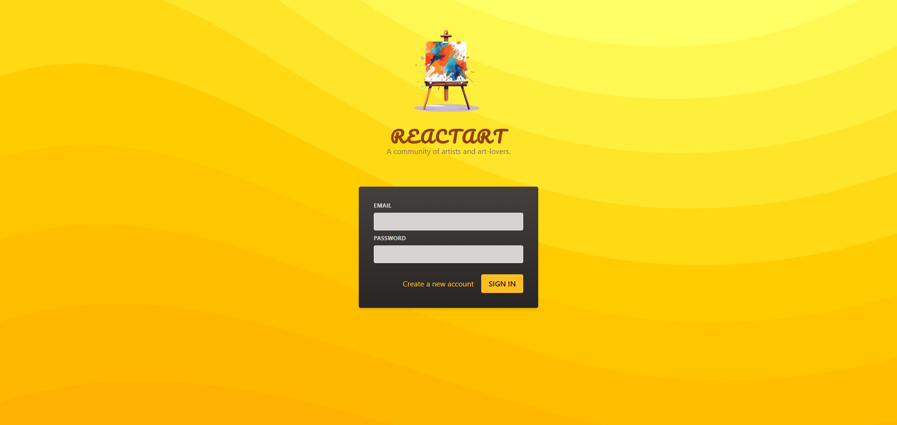

# Styling React Progejects - React Course by Maximilian Schwarzmüller

This is the fourth project built with React, developed while following the Udemy course React - The Complete Guide 2024 (incl. Next.js, Redux), taught by Maximilian Schwarzmüller.

[Link to Udemy Course](https://www.udemy.com/course/react-the-complete-guide-incl-redux/)

## Project Description

In this project, I explored different approaches for styling React applications. The methods I learned and implemented are:

- Styling with Vanilla CSS
- Using Inline Styles
- Using CSS Modules
- Using Styled Components (third-party package)
- Using Tailwind CSS (third-party package)

## Technologies and Libraries Used

HTML: Base page structure.
CSS: Styling for components and layout.
Tailwind CSS: Utility-first CSS framework
Styled Components: CSS-in-JS library
JavaScript (ES6+): Logic and interactivity.
React JS: Building user interface components.

## Key Concepts Learned

1. How to use Vanilla CSS to style a React app and apply styles conditionally and dynamically.
2. How to use Inline Styles and apply them conditionally and dynamically.
3. How to use CSS Modules and apply styles conditionally and dynamically.
4. Installing and using Styled Components with Tagged Template Literals.
5. Installing, configuring, and using Tailwind CSS with its utility classes.

## Requirements

- Node.js (I used the v22.6.0 version)
- Code Editor like VS Code

## Installation

1. Clone the repository

```bash
git clone https://github.com/luigitarallo/4-project-styling-react-components.git
```

2. Install dependencies

```bash
npm install
```

3. Run the dev server

```bash
npm run dev
```

The app will be available at `http://localhost:5173/`

## Screenshot


